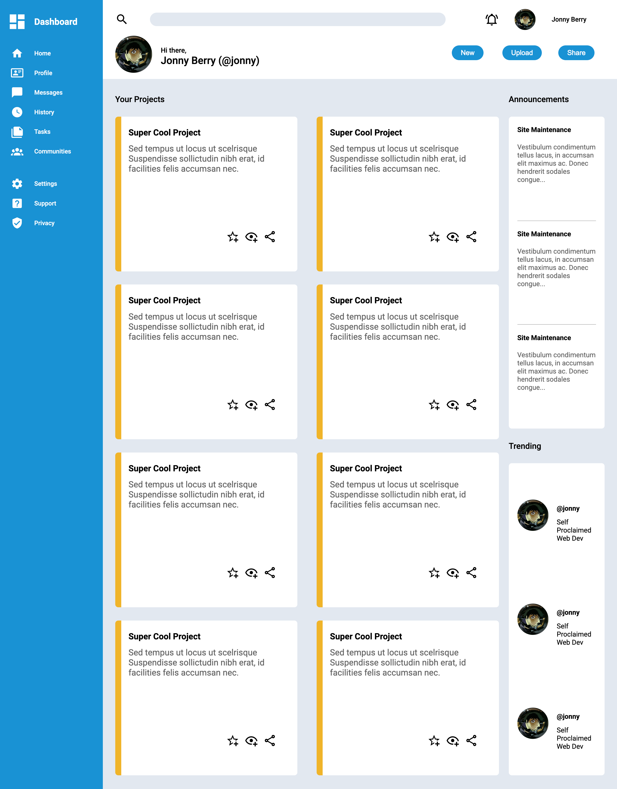
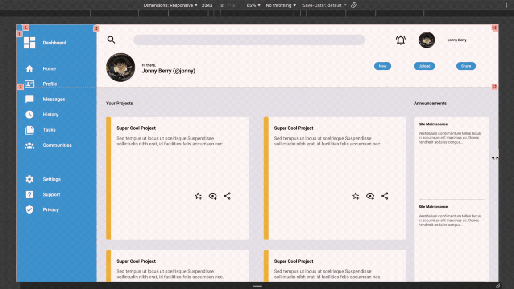

# CSS Grid Dashboard
### Built with 
  - HTML5
  - CSS3 (Grid & Flexbox)

This is a dashboard project I built while learning CSS grid through The Odin Project.

The entire layout is made with grids... I'm talking ***grids on grids on grids***.

It features a responsive design for desktop and tablet screens.

### Live Demo: https://jonny-berry.github.io/css-grid-practice/

---

## Connect with me
- jonnydevvs@gmail.com
- [GitHub](https://github.com/JonnyFPS)
- [Twitter/X](https://x.com/jonnyDevvs)